# Graph-RAG Disease Assistant

## Overview

Text-Graph-RAG is a Graph Retrieval-Augmented Generation system for disease content (the bundled demo uses ophthalmology data). It combines:

1. **Knowledge Graph Construction** – `ingest.py` relies on the lightweight `nano_graphrag` pipeline to chunk Markdown documents (e.g., `demo_data/eyes.md`), extract diseases / symptoms / treatments, and populate Neo4j (Disease, Symptom, Treatment, Medication, RiskFactor, CareTip).
2. **Hybrid Question Answering** – `main.py` orchestrates `GraphDataPreparationModule`, `MilvusIndexConstructionModule`, `HybridRetrievalModule`, `GraphRAGRetrieval`, `IntelligentQueryRouter`, and the OpenAI-powered `GenerationIntegrationModule` to answer user questions with graph-aware reasoning.

## Repository Layout

| Path | Description |
| --- | --- |
| `demo_data/` | Sample disease markdowns (with `## 别名 / alias` sections) |
| `rag_modules/` | Core Graph-RAG modules (data prep, indexing, retrieval, generation, router, ingestor) |
| `nano_graphrag/` | Lightweight GraphRAG utilities (chunking, LLM prompts, storage backends) |
| `docker-compose.yml` | Milvus single-node stack (etcd + MinIO + milvus-standalone) |
| `ingest.py` | CLI for Markdown → Graph → Neo4j ingestion |
| `main.py` | Starts the “BrightSight” disease assistant |

## Requirements

- Python ≥ 3.10 (conda environment `graph-rag` recommended)
- `pip install -r requirements.txt`
- Docker & Docker Compose (for Milvus standalone deployment)
- Neo4j (either via Docker or external server)
- OpenAI API key (`OPENAI_API_KEY`)

Typical environment variables:

```bash
export NEO4J_URI=bolt://localhost:7687
export NEO4J_USER=neo4j
export NEO4J_PASSWORD=all-in-rag

export MILVUS_HOST=localhost
export MILVUS_PORT=19530

export OPENAI_API_KEY=sk-xxxx
```

## Quick Start

1. **Install dependencies**
   ```bash
   conda activate graph-rag
   pip install -r requirements.txt
   ```

2. **Start infrastructure**
   ```bash
   docker compose up -d
   docker compose ps
   ```
   - Neo4j Browser: `http://localhost:7474`
   - Milvus health check: `http://localhost:9091/healthz`

3. **Build the graph**
   ```bash
   # (Optional) reset Neo4j/Milvus before ingesting
   cypher-shell -u neo4j -p all-in-rag "MATCH (n) DETACH DELETE n;"
   python drop_milvus_collection.py

   python ingest.py \
     --data-path demo_data \
     --domain medical \
     --llm-concurrency 16 \
     --working-dir ./.nano_cache_medical
   ```

4. **Launch the assistant**
   ```bash
   python main.py
   ```
   CLI commands: `stats`, `rebuild`, `quit`, plus free-form questions (“眼睛刺痛怎么办?”).

## Architecture Diagram

```mermaid
flowchart TD
    START["🚀 Start Graph RAG system"] --> CONFIG["⚙️ Load config<br/>GraphRAGConfig"]
    CONFIG --> INIT_CHECK{"🔍 Dependency check"}
    INIT_CHECK -->|Neo4j failed| NEO4J_ERROR["❌ Neo4j error<br/>Check graph DB"]
    INIT_CHECK -->|Milvus failed| MILVUS_ERROR["❌ Milvus error<br/>Check vector DB"]
    INIT_CHECK -->|LLM failed| LLM_ERROR["❌ LLM error<br/>Check API key"]
    INIT_CHECK -->|OK| INIT_MODULES["✅ Init core modules"]
    INIT_MODULES --> KB_CHECK{"📚 Knowledge base status"}
    KB_CHECK -->|Collection exists| LOAD_KB["⚡ Load existing KB"]
    KB_CHECK -->|No collection| BUILD_KB["🔨 Build/refresh KB"]
    LOAD_KB --> LOAD_SUCCESS{"Load success?"}
    LOAD_SUCCESS -->|Yes| SYSTEM_READY["✅ Ready<br/>Show stats"]
    LOAD_SUCCESS -->|No| REBUILD_KB["🔄 Rebuild KB"]
    BUILD_KB --> INGEST_FLOW["📥 Ingest entry<br/>ingest.py --domain medical"]
    REBUILD_KB --> INGEST_FLOW
    INGEST_FLOW --> MARKDOWN_LOAD["📄 Read Markdown<br/>demo_data/eyes.md"]
    MARKDOWN_LOAD --> NANO_GRAPHRAG["🧩 nano_graphrag extract<br/>chunks + entities/relations"]
    NANO_GRAPHRAG --> NEO4J_LOAD["🔗 Write Neo4j<br/>Disease/Symptom/..."]
    NEO4J_LOAD --> BUILD_DOCS["📝 Build structured docs<br/>symptoms/treatments/risks/care"]
    BUILD_DOCS --> CHUNK_DOCS["✂️ Chunk docs"]
    CHUNK_DOCS --> BUILD_VECTOR["🎯 Build Milvus index"]
    BUILD_VECTOR --> SYSTEM_READY
    SYSTEM_READY --> USER_INPUT["👤 User query"]
    USER_INPUT --> SPECIAL_CMD{"🔍 Special command?"}
    SPECIAL_CMD -->|stats| STATS["📊 Stats"]
    SPECIAL_CMD -->|rebuild| REBUILD_CMD["🔄 Rebuild KB command"]
    SPECIAL_CMD -->|quit| EXIT["👋 Exit"]
    SPECIAL_CMD -->|normal query| QUERY_ANALYSIS["🧠 Query analysis"]
    QUERY_ANALYSIS --> COMPLEXITY_ANALYSIS["📊 Complexity"]
    QUERY_ANALYSIS --> RELATION_ANALYSIS["🔗 Relation density"]
    QUERY_ANALYSIS --> REASONING_ANALYSIS["🤔 Reasoning need"]
    QUERY_ANALYSIS --> ENTITY_ANALYSIS["🏷️ Entity count"]
    COMPLEXITY_ANALYSIS --> LLM_ANALYSIS["🤖 LLM analysis"]
    RELATION_ANALYSIS --> LLM_ANALYSIS
    REASONING_ANALYSIS --> LLM_ANALYSIS
    ENTITY_ANALYSIS --> LLM_ANALYSIS
    LLM_ANALYSIS --> ANALYSIS_SUCCESS{"Analysis OK?"}
    ANALYSIS_SUCCESS -->|Yes| ROUTE_DECISION["🎯 Routing decision"]
    ANALYSIS_SUCCESS -->|No| RULE_FALLBACK["📋 Rule-based fallback"]
    RULE_FALLBACK --> ROUTE_DECISION
    ROUTE_DECISION -->|Simple| HYBRID_SEARCH["🔍 Hybrid search"]
    ROUTE_DECISION -->|Complex| GRAPH_RAG_SEARCH["🕸️ Graph RAG search"]
    ROUTE_DECISION -->|Mixed| COMBINED_SEARCH["🔄 Combined search"]
    HYBRID_SEARCH --> HYBRID_SUCCESS{"Success?"}
    GRAPH_RAG_SEARCH --> GRAPH_SUCCESS{"Success?"}
    COMBINED_SEARCH --> COMBINED_SUCCESS{"Success?"}
    GRAPH_SUCCESS -->|Fail| FALLBACK_TO_HYBRID["⬇️ Fallback to hybrid"]
    COMBINED_SUCCESS -->|Fail| FALLBACK_TO_HYBRID
    HYBRID_SUCCESS -->|Fail| SYSTEM_ERROR["❌ Hybrid failed"]
    FALLBACK_TO_HYBRID --> FALLBACK_SUCCESS{"Success?"}
    FALLBACK_SUCCESS -->|Fail| SYSTEM_ERROR
    HYBRID_SUCCESS -->|Yes| GENERATE["🎨 LLM answer"]
    GRAPH_SUCCESS -->|Yes| GENERATE
    COMBINED_SUCCESS -->|Yes| GENERATE
    FALLBACK_SUCCESS -->|Yes| GENERATE
    GENERATE --> STREAM_OUTPUT["📺 Stream output"]
    STREAM_OUTPUT --> UPDATE_STATS["📈 Update stats"]
    UPDATE_STATS --> USER_INPUT
    STATS --> USER_INPUT
    REBUILD_CMD --> BUILD_KB
    NEO4J_ERROR --> EXIT
    MILVUS_ERROR --> EXIT
    LLM_ERROR --> EXIT
    SYSTEM_ERROR --> USER_INPUT
```



## Troubleshooting

| Symptom | Fix |
| --- | --- |
| `Fail connecting to server on localhost:19530` | Milvus containers are down. Run `docker compose up -d` and retry. |
| `field entity_name not exist` | Old Milvus schema still active. Drop the `cooking_knowledge` collection and re-run `ingest.py`. |
| OpenAI 401 / `Invalid Authentication` | Ensure `OPENAI_API_KEY` is exported; check proxy / network settings. |
| `Expecting value: line 1 column 1 (char 0)` | Some OpenAI responses include natural language before JSON. Add `response_format={"type": "json_object"}` or trim the prefix before `json.loads` in `IntelligentQueryRouter`. |

## Bonus Utilities

- `drop_milvus_collection.py` – small helper to remove the current Milvus collection.
- `agent/run_ai_agent.py` – the original recipe-ingestor workflow (handy if you want to bootstrap non-medical data).

## License & Usage

This repository is intended for research and prototyping. Make sure you have permission to use any medical content, and secure your OpenAI credentials before deploying to production environments.
