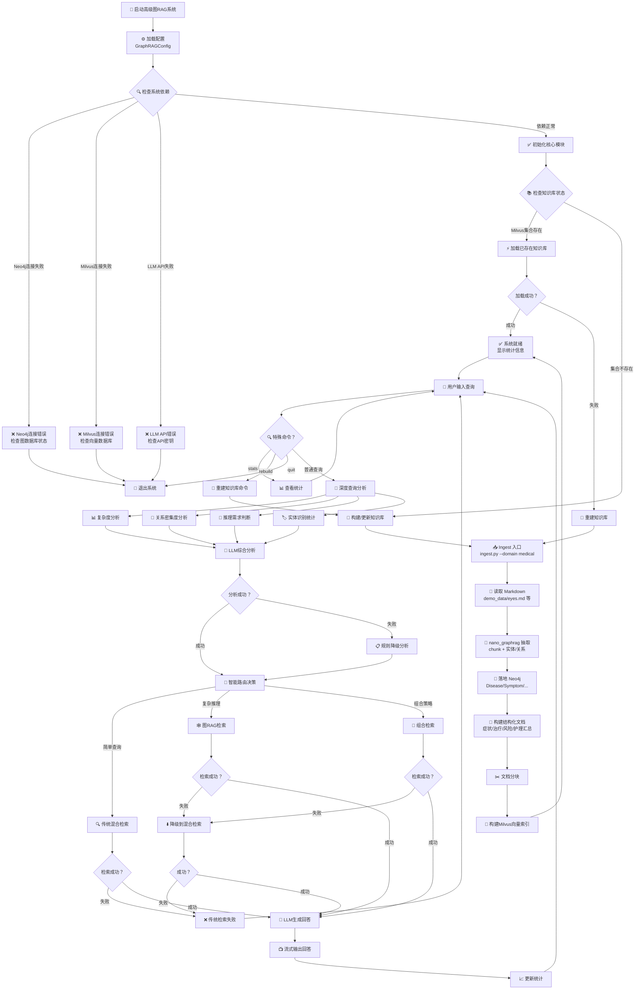

# 图谱驱动的眼科疾病 RAG 系统

## 概述

Text-Graph-RAG 项目将 Neo4j 图数据库、Milvus 向量库与 OpenAI LLM 结合，构建了一个能够“看懂”眼科疾病文档、并在问答阶段自动选择检索策略的 Graph RAG 系统。项目包含两条主线：

1. **图谱构建**：`ingest.py` + `rag_modules/text_to_graph_ingestor.py` 负责解析 `demo_data/` 下的 Markdown，利用 nano-graphrag 抽取实体/关系，落地到 Neo4j（Disease/Symptom/Treatment/Medication/...）。
2. **问答系统**：`main.py` 调度 `GraphDataPreparationModule`、`MilvusIndexConstructionModule`、`HybridRetrievalModule`、`GraphRAGRetrieval`、`IntelligentQueryRouter` 等模块，实现传统检索 + 图检索 + 流式回答。

## 目录速览

| 目录/文件 | 说明 |
| --- | --- |
| `demo_data/eyes.md` | 示例疾病 Markdown，包含 `## 别名`、症状、治疗等结构化段落 |
| `rag_modules/` | 自研 Graph RAG 组件（数据准备、索引、检索、生成、路由、ingestor） |
| `nano_graphrag/` | 轻量版 GraphRAG 依赖（chunking、entity extraction、storage） |
| `docker-compose.yml` | 本地 Milvus 依赖（etcd + MinIO + milvus-standalone） |
| `ingest.py` | 将 Markdown -> Graph -> Neo4j 的 CLI |
| `main.py` | 启动“明眸 RAG 疾病助手”的入口 |

## 环境与依赖

- Python >= 3.10（建议使用仓库中的 conda 环境 `graph-rag`）
- Pip 依赖：`pip install -r requirements.txt`
- Docker / Docker Compose：用于启动本地 Milvus 组件
- Neo4j：可直接使用 `docker compose` 启动的本地实例，或外部 Neo4j 服务器
- OpenAI API Key：通过环境变量 `OPENAI_API_KEY` 提供

建议在项目根目录创建 `.env`（或修改 `config.py`）以统一管理：

```bash
# Neo4j
export NEO4J_URI=bolt://localhost:7687
export NEO4J_USER=neo4j
export NEO4J_PASSWORD=all-in-rag

# Milvus
export MILVUS_HOST=localhost
export MILVUS_PORT=19530

# OpenAI
export OPENAI_API_KEY=sk-xxxx
```

## 快速开始

1. **安装依赖**
   ```bash
   conda activate graph-rag
   pip install -r requirements.txt
   ```

2. **启动 Neo4j 与 Milvus**
   ```bash
   docker compose up -d
   # 检查状态
   docker compose ps
   ```
   默认 Neo4j Browser 在 `http://localhost:7474`；Milvus 监听 `localhost:19530` / `localhost:9091`.

3. **构建知识图谱**
   ```bash
   # 重新 ingest 前建议清空 Neo4j、删除旧 Milvus 集合
   cypher-shell -u neo4j -p all-in-rag "MATCH (n) DETACH DELETE n;"
   python drop_milvus_collection.py  # 同 README_EN.md 的说明

   python ingest.py \
     --data-path demo_data \
     --domain medical \
     --llm-concurrency 16 \
     --working-dir ./.nano_cache_medical
   ```
   脚本会解析所有 `.md`，自动写入 Neo4j。

4. **运行问答系统**
   ```bash
   python main.py
   ```
   控制台提供 `stats` / `rebuild` / `quit` 等命令，可直接与“明眸 RAG 疾病助手”对话。

## 系统流程架构图



## 常见问题

| 问题 | 解决方案 |
| --- | --- |
| `Fail connecting to server on localhost:19530` | 确认 `docker compose up -d` 已启动 Milvus；或修改 `config.py` 里的 `milvus_host/port` 指向正确地址 |
| `field entity_name not exist` | Milvus 仍使用旧 schema，执行 `python drop_milvus_collection.py` 删除集合后重新 `python ingest.py` 和 `python main.py` |
| OpenAI 401 / `Invalid Authentication` | 确保 `OPENAI_API_KEY` 已设置且未被墙；必要时设置代理 |
| LLM 输出无法解析 JSON | 当前路由器会回退到规则模式，可在 `IntelligentQueryRouter` 中启用 `response_format={"type": "json_object"}` 或添加解析容错 |

## 其他工具

- `agent/run_ai_agent.py`：批量解析菜谱（原始项目遗留），可作为自定义数据 pipeline 的参考。
- `drop_milvus_collection.py`：便捷地删除 Milvus 集合。

## 许可

项目仅用于学习/实验目的，部署前请确认已获得所有数据和 API 的合法授权。
